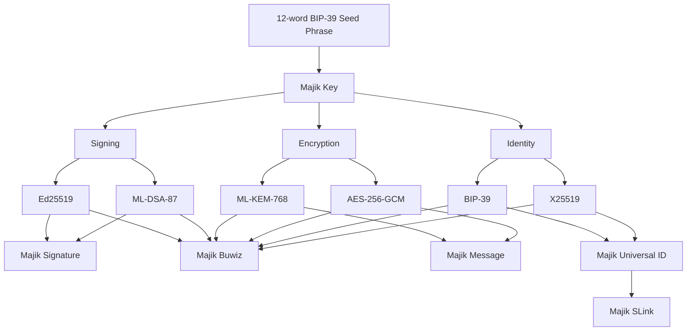

# Majik Key

[](https://www.thezelijah.world) 
   [](https://opensource.org/licenses/Apache-2.0)

**Majik Key** is a next-generation seed phrase account library for creating and managing mnemonic-based identities. It serves as a post-quantum ready, high-security bridge between BIP39 mnemonics and the broader Majikah ecosystem.

---

## Next-Gen Security Architecture

Majik Key is engineered to meet and exceed modern cryptographic standards. 

*   **Self-Encrypted at Rest:** Majik Keys are self-encrypted by default. Private keys are **always Argon2id hashed at rest**, which completely protects them from unauthorized access even if the underlying storage medium is compromised.
*   **Post-Quantum Ready (ML-KEM):** Generates a deterministic dual-key system from a 64-byte BIP39 seed, featuring **X25519** for legacy compatibility and **ML-KEM-768 (FIPS-203)** for post-quantum key encapsulation.
*   **Argon2id Key Derivation:** Private keys at rest are protected by memory-hard **Argon2id (KDF v2)**, configured to defeat GPU/ASIC brute-force attacks (64 MB memory / 3 iterations / 4 parallelism).
*   **Seamless Auto-Migration:** Automatically detects and upgrades legacy v1 (PBKDF2) accounts to v2 upon import, deterministically re-deriving missing ML-KEM keys from the seed.
   
---

## The Majik Key



Your Majik Key is generated entirely offline. No network request is made during key creation — verifiable in source code.

---

## Experimental Web3 Support

Majik Key features experimental integration for deriving keys natively compatible with modern Web3 ecosystems, specifically **Bitcoin** and **Solana**. 

To utilize these features, you must install the optional peer dependencies associated with your target chain:

### Bitcoin
Requires the `@scure/btc-signer` peer dependency.
```bash
npm install @scure/btc-signer
```

### Solana
Requires the `@solana/kit` peer dependency.
```bash
npm install @solana/kit
```

---

## Overview

Majik Key provides a secure, intuitive way to create, store, and manage mnemonic-based cryptographic identities. 

### Use Cases
*   **Majik Message Integration:** Natively generate identities compatible with Majik Message v3 secure envelopes.
*   **Cryptographic Identity Management:** Manage multiple identities with deterministic multi-key derivation.
*   **Secure Storage & Recovery:** Built-in AES-GCM authenticated encryption for private keys at rest, with secure backup/recovery workflows.

---

## Features

*   **Maximum Security:** ML-KEM-768 readiness and Argon2id derivation. Private keys are purged from memory immediately upon calling `.lock()`.
*   **BIP39 Compliance:** High-entropy 12 or 24-word seed generation with built-in validation.
*   **Isomorphic DX:** First-class TypeScript support, fluent method chaining, and compatibility across Node.js and modern browsers.
*   **Portable Storage:** Safe JSON serialization and MnemonicJSON formats that never expose raw private keys.

---

## Installation

```bash
npm install @majikah/majik-key
```

---

## Quick Start (Core Identity)

Get up and running with a secure, unlockable account in seconds.

```typescript
import { MajikKey } from '@majikah/majik-key';

// 1. Generate & Create
const mnemonic = MajikKey.generateMnemonic(); // Generates 12 words
const key = await MajikKey.create(mnemonic, 'super-secure-passphrase', 'My PQ Account');

// 2. Access Identity
console.log('Fingerprint:', key.fingerprint);
console.log('Key ID:', key.id);
console.log('Unlocked?', key.isUnlocked); // true

// 3. Lock to purge private keys from memory
key.lock();

// 4. Unlock when cryptographic operations are needed
await key.unlock('super-secure-passphrase');
const privateKeyBase64 = key.getPrivateKeyBase64();

// 5. Safe Storage (Private keys are encrypted at rest)
localStorage.setItem('myKey', key.toString());
```

---

## API Reference

### Static Methods (Lifecycle & Generation)

| Method                       | Parameters                                   | Returns             | Description                                         |
| :--------------------------- | :------------------------------------------- | :------------------ | :-------------------------------------------------- |
| `create()`                   | `mnemonic`, `passphrase`, `label?`           | `Promise<MajikKey>` | Creates a new Argon2id-protected account.           |
| `fromJSON()`                 | `json`                                       | `MajikKey`          | Loads a locked key from safe JSON storage.          |
| `fromMnemonicJSON()`         | `mnemonicJson`, `passphrase`, `label?`       | `Promise<MajikKey>` | Auto-migrates legacy accounts to Argon2id + ML-KEM. |
| `importFromMnemonicBackup()` | `backup`, `mnemonic`, `passphrase`, `label?` | `Promise<MajikKey>` | Restores a key from a mnemonic-encrypted string.    |
| `generateMnemonic()`         | `strength?` *(128 \| 256)*                   | `string`            | Generates a 12 or 24-word BIP39 phrase.             |
| `validateMnemonic()`         | `mnemonic`                                   | `boolean`           | Validates a BIP39 mnemonic phrase.                  |

### Instance Methods (State & Management)

| Method               | Parameters               | Returns            | Description                                        |
| :------------------- | :----------------------- | :----------------- | :------------------------------------------------- |
| `unlock()`           | `passphrase`             | `Promise<this>`    | Decrypts keys into memory. Chainable.              |
| `lock()`             | None                     | `this`             | Purges private keys from memory. Chainable.        |
| `verify()`           | `passphrase`             | `Promise<boolean>` | Tests a passphrase without keeping keys in memory. |
| `updatePassphrase()` | `currentPass`, `newPass` | `Promise<this>`    | Changes passphrase and auto-migrates to KDF v2.    |
| `updateLabel()`      | `newLabel`               | `this`             | Updates the human-readable account label.          |

### Export & Integration Methods

| Method                     | Returns                   | Description                                         |
| :------------------------- | :------------------------ | :-------------------------------------------------- |
| `toJSON()` / `toString()`  | `MajikKeyJSON` / `string` | Safe export for DB/LocalStorage. No raw keys.       |
| `toMnemonicJSON()`         | `MnemonicJSON`            | Portable seed format (Requires key to be unlocked). |
| `exportMnemonicBackup()`   | `Promise<string>`         | Base64-encoded encrypted backup string.             |
| `toContact()`              | `MajikContact`            | Extracts public identity data for sharing.          |
| `toMajikMessageIdentity()` | `Promise<Identity>`       | Formats key for direct use in Majik Message.        |

### Instance Getters
*Access public data at any time:*
`id`, `fingerprint`, `publicKey`, `publicKeyBase64`, `label`, `backup`, `timestamp`, `isLocked`, `isUnlocked`, `metadata`.

*Access restricted data (Throws `MajikKeyError` if locked):*
`getPrivateKey()`, `getPrivateKeyBase64()`.

---

## Usage Examples

### 1. Secure Backup & Recovery Workflow

```typescript
import { MajikKey } from '@majikah/majik-key';

// -- EXPORTING --
const jsonData = key.toMnemonicJSON(mnemonic, 'password123');
const blob = new Blob([JSON.stringify(jsonData)], { type: "application/json" });
// Save blob locally...

// -- RECOVERING --
const recoveredData = JSON.parse(await blob.text());
const recoveredKey = await MajikKey.importFromMnemonicBackup(
  recoveredData.id,
  recoveredData.seed.join(" "), 
  recoveredData.phrase,
  'Recovered Key'
);
```

### 2. Password Verification Before Action

```typescript
const key = MajikKey.fromJSON(storedJson);

if (await key.verify('user-input-password')) {
  await key.unlock('user-input-password');
  // ... proceed with signing/encryption
  key.lock(); // Always clean up!
} else {
  throw new Error("Invalid passphrase");
}
```


---

### [Majik Signature](https://majikah.solutions/products/majik-signature)  — Flagship
**Post-quantum cryptographic file signing and verification.**

[](https://www.npmjs.com/package/@majikah/majik-signature) [](https://www.npmjs.com/package/@majikah/majik-signature) [](https://bundlephobia.com/package/@majikah/majik-signature) [](https://opensource.org/licenses/Apache-2.0)

[](https://signature.majikah.solutions)


**Majik Signature** is the flagship feature of the ecosystem, providing hybrid classical and post-quantum content signing. It secures your files by requiring both an **Ed25519** (classical) and an **ML-DSA-87** (post-quantum) signature to pass verification.

*   **Hybrid Security:** Verification requires BOTH signatures to pass, ensuring robust forward-secrecy.
*   **Embedded Multi-Sig:** Seamlessly embeds signatures into files with full support for multi-signature envelopes.
*   **Cryptographic Allowlists:** Establish an expected list of signers. Non-listed signers are rejected cryptographically.
*   **Sealing:** The issuer can compute a SHA3-512 seal over the signatories, preventing any further signing attempts.

### Majik Signature Quick Start

```typescript
import { MajikSignature, MajikKey } from '@majikah/majik-key';

// 1. Sign a file and embed the signature (Requires an unlocked key with signing keys)
const { blob, signature } = await MajikSignature.signFile(myFileBlob, myUnlockedKey, {
  // Optional: restrict future signers
  expectedSigners: [ MajikSignature.expectedSignerFromKey(myUnlockedKey) ] 
});

// 2. Verify a signed file's embedded signatures
const results = await MajikSignature.verifyFile(blob, myUnlockedKey);

results.forEach(res => {
    console.log(`Signer ${res.signerId} valid?`, res.valid);
});

// 3. Seal a multi-sig file to prevent further signatures
const { sealInfo } = await MajikSignature.seal(blob, myUnlockedKey);
console.log("File sealed at:", sealInfo.sealTimestamp);
```


---

## Security Best Practices

✅ **DO:** 
*   Lock keys (`.lock()`) immediately after signing or decrypting payloads to free memory.
*   Utilize `mlKemPublicKey` for all new communication protocols to ensure PQ-readiness.
*   Keep `@scure/bip39` and underlying crypto dependencies updated.

❌ **DON'T:** 
*   Log `mnemonic` phrases or `privateKeyBase64` outputs in production environments.
*   Use `toDangerousJSON()` unless handling highly specific server-side secret injections.

---

## Ecosystem

*   [Majik Signature Web App](https://signature.majikah.solutions)
*   [Majik Signature on Microsoft Store](https://apps.microsoft.com/detail/9pl9g3xzvd1x)
*   [Majik Signature Official Repository](https://github.com/Majikah/majik-signature)

---

## License & Author

**License:** [Apache-2.0](LICENSE) — free for personal and commercial use.

Developed by **Josef Elijah Fabian (Zelijah)** | [Majikah Solutions OPC](https://majikah.solutions/about)

*   **GitHub:** [@jedlsf](https://github.com/jedlsf)
*   **Website:** [https://www.thezelijah.world](https://www.thezelijah.world)
*   **Email:** [business@thezelijah.world](mailto:business@thezelijah.world)