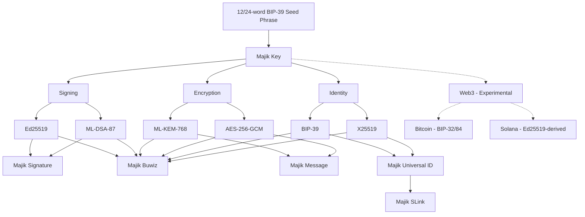

# Majik Key

[](https://www.thezelijah.world) 
   [](https://opensource.org/licenses/Apache-2.0)

**Majik Key** turns a single BIP-39 mnemonic into a complete cryptographic identity — encryption, classical + post-quantum signing, and (experimentally) Bitcoin and Solana keys — encrypted at rest and ready to plug into the rest of the Majikah ecosystem.

---

## Why Majik Key

- **One seed, one identity, five key pairs.** A 12- or 24-word mnemonic deterministically derives X25519, ML-KEM-768, Ed25519, ML-DSA-87, and (by default) a domain-separated Bitcoin key — all reproducible from the mnemonic alone.
- **Post-quantum from day one.** Every account gets an ML-KEM-768 (FIPS-203) encryption keypair and an ML-DSA-87 signing keypair alongside their classical counterparts (X25519, Ed25519) — no separate migration project required later.
- **Encrypted at rest, always.** Private key material is never persisted in plaintext. Everything is AES-256-GCM encrypted using a key derived with Argon2id.
- **Local-first.** Key generation and derivation run entirely offline — no network request is made in the process, verifiable directly in source.
- **Built for the Majikah ecosystem**, but usable standalone in any TypeScript/JavaScript project.

---

## Security Architecture

- **Encrypted at rest, not "hashed."** Private keys are **AES-256-GCM encrypted**, using a 256-bit key **derived via Argon2id** from your passphrase. (Argon2id is a key-derivation function, not applied to the private key directly — the private key itself is encrypted, not hashed.)
- **Argon2id KDF (v2), memory-hard by design.** Passphrase-based encryption uses Argon2id at **64 MB memory / 3 iterations / 4 parallel lanes**, tuned to resist GPU/ASIC brute-force attacks. A WASM implementation (`hash-wasm`) is used when available in the runtime, with an automatic, transparent fallback to a pure-JS implementation (`@noble/hashes`) — output is bit-identical either way, so switching implementations never breaks decryption.
- **Post-quantum ready.** ML-KEM-768 (FIPS-203) is derived from the full 64-byte BIP-39 seed for encryption/key-encapsulation, and ML-DSA-87 is derived from a domain-separated hash of that same seed for signing — both deterministic and fully recoverable from the mnemonic.
- **Legacy KDF read support.** Older accounts encrypted with KDF v1 (PBKDF2-SHA256, 200k–250k iterations) can still be unlocked. New accounts, and any account whose passphrase is changed via `updatePassphrase()`, always land on Argon2id (v2).
- **Full migration path.** `importFromMnemonicBackup()` re-derives a complete identity straight from the mnemonic — X25519, ML-KEM-768, Ed25519, ML-DSA-87, and Bitcoin — and re-encrypts everything with Argon2id in one step, so an old account becomes fully post-quantum capable automatically. A lighter `migrate()` method is also available if you only want to upgrade the KDF version without re-deriving the newer key types.
- **Isomorphic by design.** Uses native WebCrypto (ECDH/X25519) where the runtime supports it, and transparently falls back to a raw keypair representation where it doesn't (e.g. Node environments without X25519 in WebCrypto) — the public API is identical either way.
- **Multi-language mnemonics.** BIP-39 wordlists for English, French, Spanish, Italian, Japanese, Korean, Czech, Portuguese, Simplified Chinese, and Traditional Chinese are supported, lazy-loaded per language so you only pay for the ones you use.

---

## Architecture



Your Majik Key is generated entirely offline. No network request is made during key creation — verifiable in source code.

---

## Powering the Majikah Ecosystem

Majik Key is the shared identity layer underneath every Majikah product. Here's what each one draws from it.

### [Majik Signature](https://majikah.solutions/products/majik-signature) — Flagship

**Post-quantum cryptographic file signing and verification.**

[](https://www.npmjs.com/package/@majikah/majik-signature) [](https://www.npmjs.com/package/@majikah/majik-signature) [](https://bundlephobia.com/package/@majikah/majik-signature) [](https://opensource.org/licenses/Apache-2.0)

[](https://signature.majikah.solutions)

Majik Signature consumes a Majik Key's **Ed25519** and **ML-DSA-87** signing keypairs to require *both* a classical and a post-quantum signature before a file verifies — hybrid security with forward secrecy against future quantum attacks on either scheme alone.

```typescript
import { MajikKey } from '@majikah/majik-key';
import { MajikSignature } from '@majikah/majik-signature';

// 1. Sign a file and embed the signature (requires an unlocked key with signing keys)
const { blob, signature } = await MajikSignature.signFile(myFileBlob, myUnlockedKey, {
  // Optional: restrict future signers
  expectedSigners: [ MajikSignature.expectedSignerFromKey(myUnlockedKey) ]
});

// 2. Verify a signed file's embedded signatures
const results = await MajikSignature.verifyFile(blob, myUnlockedKey);
results.forEach(res => {
  console.log(`Signer ${res.signerId} valid?`, res.valid);
});

// 3. Seal a multi-sig file to prevent further signatures
const { sealInfo } = await MajikSignature.seal(blob, myUnlockedKey);
console.log("File sealed at:", sealInfo.sealTimestamp);
```

### Majik Message

**Post-quantum secure messaging envelopes.**

Majik Key derives an ML-KEM-768 keypair specifically so it can be used for Majik Message's v3 secure envelopes — the ML-KEM-768 keypair handles post-quantum key encapsulation, and AES-256-GCM handles the actual payload encryption once a shared secret is established.

Majik Key ships a direct integration point for this: `toMajikMessageIdentity()` converts an unlocked key into a `MajikMessageIdentity`, ready to hand to Majik Message.

```typescript
import { MajikKey } from '@majikah/majik-key';

// user: an existing MajikUser instance (from @thezelijah/majik-user)
const identity = await key.toMajikMessageIdentity(user, {
  label: 'My Device',
  restricted: false,
});
```

### Majik Buwiz

**Multi-key custody built on the full Majik Key stack.**

Majik Buwiz is built on Majik Key's complete key set: Ed25519/ML-DSA-87 for signing, ML-KEM-768/AES-256-GCM for encryption, and X25519/BIP-39 for identity — plus the experimental Bitcoin and Solana keys described below for multi-chain support. Everything a Buwiz account needs is derivable from, and recoverable with, the same mnemonic.

### Majik Universal ID & Majik SLink

**A portable identity primitive, and shareable links built on top of it.**

Majik Universal ID is built on the Identity branch of Majik Key — the BIP-39-derived X25519 keypair, public key, and fingerprint, exportable via `toContact()` as a `MajikContact` for use across apps. Majik SLink extends that identity layer downstream, per the architecture above. Both are separate Majikah packages; consult [majikah.solutions](https://majikah.solutions) for the latest on their APIs.

---

## Experimental Web3 Support

Majik Key can derive **Bitcoin** and **Solana** key material directly from the same mnemonic. This is marked experimental — the shape of the `web3` namespace may change without a major version bump.

### What's built in vs. what needs an extra install

- **Bitcoin key derivation is automatic.** Every account created via `create()` or `importFromMnemonicBackup()` also derives and encrypts a Bitcoin keypair (real BIP-32 HD derivation off the raw 64-byte seed, using a Majik-specific domain-separated path by default). This works out of the box — no extra install needed for the private key, public key, or WIF export.
- **Solana key derivation is on-demand.** Rather than storing a separate Solana keypair, Majik Key derives it deterministically from your Ed25519 signing key each time you access `key.web3.solana` (and caches it in memory for as long as the key stays unlocked). The base58 Solana address also works with no extra install.
- **The optional peer dependencies are only needed for chain-native address/transaction objects:**

| Chain | Peer dependency | Needed for |
| :--- | :--- | :--- |
| Bitcoin | `@scure/btc-signer` | Native SegWit (bech32) address encoding, PSBT construction |
| Solana | `@solana/kit` | Real `KeyPairSigner` instances, kit-native `Address` type |

```bash
npm install @scure/btc-signer   # for Bitcoin addresses
npm install @solana/kit         # for Solana signer/address objects
```

Everything else — raw key bytes, WIF export, message signing (ECDSA/Schnorr for Bitcoin, Ed25519 for Solana), and base58 Solana addresses — works with zero extra dependencies.

### Two Bitcoin paths, on purpose

By default, Bitcoin keys use `MAJIK_BITCOIN_DOMAIN_PATH` — a real, standard BIP-32 derivation, but not the path a generic wallet would derive by default, so it stays effectively private to Majik. Pass `{ standard: true }` to derive the actual BIP-84 mainnet path instead — the address any standard wallet would show for the same mnemonic:

```typescript
// Majik's default (domain-separated, stored on the key)
const wif = key.getBitcoinWIF();

// The real BIP-84 mainnet key — recoverable in any standard wallet
const standardBtc = await MajikKey.deriveStandardBitcoinFromMnemonic(mnemonic);
```

### Two Solana paths, on purpose

By default (`deriveSolanaKeypairFromEdSecretKey`), the Solana keypair is domain-separated from your Ed25519 message-signing key via `SHA256(edSeed || "MajikMessageSolanaSeed")`, so the same private key never secures two different protocols. You can opt into reusing your Ed25519 message-signing key directly instead:

```typescript
// Recommended: domain-separated Solana key
const solanaAddress = key.getSolanaAddress();

// Opt-in: reuse the Ed25519 message-signing key as-is (not recommended)
const reusedAddress = key.getSolanaAddress({ reuseMessageKey: true });
```

---

## Installation

```bash
npm install @majikah/majik-key
```

---

## Quick Start (Core Identity)

```typescript
import { MajikKey } from '@majikah/majik-key';

// 1. Generate & Create
const mnemonic = await MajikKey.generateMnemonic(); // 12 words (128-bit)
const key = await MajikKey.create(mnemonic, 'super-secure-passphrase', 'My PQ Account');

// 2. Access Identity
console.log('Fingerprint:', key.fingerprint);
console.log('Key ID:', key.id);
console.log('Unlocked?', key.isUnlocked); // true — create() returns an already-unlocked key

// 3. Lock to purge private key material from memory
key.lock();

// 4. Unlock again when cryptographic operations are needed
await key.unlock('super-secure-passphrase');
const privateKeyBase64 = key.getPrivateKeyBase64();

// 5. Safe storage — toJSON()/toString() never include raw private keys
localStorage.setItem('myKey', key.toString());
```

---

## API Reference

### Static Methods (Lifecycle & Generation)

| Method | Parameters | Returns | Description |
| :--- | :--- | :--- | :--- |
| `create()` | `mnemonic`, `passphrase`, `label?`, `mnemonicLanguage?` | `Promise<MajikKey>` | Creates a new Argon2id-protected, fully post-quantum-capable account. |
| `fromJSON()` | `json` | `MajikKey` | Loads a locked key from safe JSON storage. |
| `fromMnemonicJSON()` | `mnemonicJson`, `passphrase`, `label?` | `Promise<MajikKey>` | Rebuilds a key straight from a portable seed export. |
| `importFromMnemonicBackup()` | `backup`, `mnemonic`, `passphrase`, `label?`, `mnemonicLanguage?` | `Promise<MajikKey>` | Full migration path — verifies the mnemonic, then re-derives and re-encrypts the complete identity with Argon2id. |
| `fromDangerousJSON()` | `json` | `MajikKey` | Reconstructs an already-unlocked key from a dangerous export. Server-side only — see warning below. |
| `generateMnemonic()` | `strength?` *(128 \| 256)*, `language?` | `Promise<string>` | Generates a 12- or 24-word BIP-39 phrase. |
| `validateMnemonic()` | `mnemonic` | `boolean` | Validates a BIP-39 mnemonic phrase. |
| `deriveStandardBitcoinFromMnemonic()` *(experimental)* | `mnemonic`, `mnemonicLanguage?` | `Promise<BitcoinKeypairMaterial>` | Derives the real BIP-84 mainnet Bitcoin key without needing a `MajikKey` instance. |

### Instance Methods (State & Management)

| Method | Parameters | Returns | Description |
| :--- | :--- | :--- | :--- |
| `unlock()` | `passphrase` | `Promise<this>` | Decrypts keys into memory. Chainable. |
| `lock()` | None | `this` | Purges all private key material (including cached Web3 keys) from memory. Chainable. |
| `verify()` | `passphrase` | `Promise<boolean>` | Tests a passphrase without keeping keys in memory or requiring an unlock. |
| `updatePassphrase()` | `currentPass`, `newPass` | `Promise<this>` | Re-encrypts every stored key under a new passphrase and migrates to KDF v2 if needed. |
| `migrate()` | `passphrase` | `Promise<this>` | Upgrades the X25519 key's KDF from v1 to v2 only — does **not** add ML-KEM/Ed25519/ML-DSA/Bitcoin keys. Use `importFromMnemonicBackup()` for a full upgrade. |
| `updateLabel()` | `newLabel` | `this` | Updates the human-readable account label. |

### Export & Integration Methods

| Method | Returns | Description |
| :--- | :--- | :--- |
| `toJSON()` / `toString()` | `MajikKeyJSON` / `string` | Safe export for DB/LocalStorage. No raw keys. |
| `toDangerousJSON()` | `MajikKeyDangerousJSON` | ⚠️ Contains every raw private key. Server-side secret injection only — see warning below. |
| `toMnemonicJSON()` | `MnemonicJSON` | ⚠️ Contains the raw mnemonic words (and passphrase, if you pass one) in plaintext — a transport format, not an at-rest storage format. Requires the key to be unlocked. |
| `exportMnemonicBackup()` | `Promise<string>` | Encrypted backup string, decryptable only with the original mnemonic — used to verify a mnemonic before `importFromMnemonicBackup()` re-derives the identity. |
| `toContact()` | `MajikContact` | Extracts public identity data for sharing (the basis for Majik Universal ID). |
| `toMajikMessageIdentity()` | `Promise<MajikMessageIdentity>` | Formats the key for direct use in Majik Message. Requires a `MajikUser`. |

### Instance Getters

*Public — available at any time, regardless of lock state:*

`id`, `fingerprint`, `publicKey`, `publicKeyBase64`, `label`, `backup`, `timestamp`, `mnemonicLanguage`, `kdfVersion`, `isArgon2id`, `isLocked`, `isUnlocked`, `isFullyUpgraded`, `mlKemPublicKey`, `hasMlKem`, `edPublicKey`, `mlDsaPublicKey`, `hasSigningKeys`, `btcPublicKey`, `hasBitcoin`, `hasSolanaKeypair`, `hasBitcoinKeypair`, `metadata`.

*Restricted — throws `MajikKeyError` if locked (or if that key type isn't present, e.g. on an account not yet fully migrated):*

`getPrivateKey()`, `getPrivateKeyBase64()`, `getMlKemSecretKey()`, `getEdSecretKey()`, `getMlDsaSecretKey()`, `getBtcSecretKey()`.

### Web3 (Experimental)

| Member | Returns | Notes |
| :--- | :--- | :--- |
| `web3` *(getter)* | `{ solana, bitcoin? } \| undefined` | `undefined` if locked or has no Ed25519 signing key. `bitcoin` is present only if the account has stored Bitcoin key material. |
| `getBitcoinKeypairMaterial()` | `BitcoinKeypairMaterial` | Raw Bitcoin keypair bytes. |
| `getBitcoinWIF()` | `string` | Wallet Import Format string, pastes into any standard Bitcoin wallet. |
| `getSolanaKeypairMaterial()` | `SolanaKeypairMaterial` | Raw Solana keypair bytes. |
| `getSolanaKeypair()` | `Promise<any>` | Real `@solana/kit` `KeyPairSigner`. Requires `@solana/kit`. |
| `getSolanaAddress()` | `string` | Base58 Solana address. No extra dependency required. |

---

## Usage Examples

### 1. Secure Backup & Recovery Workflow

```typescript
import { MajikKey } from '@majikah/majik-key';

// -- EXPORTING --
// ⚠️ jsonData contains the raw mnemonic (and passphrase, if provided) in
// plaintext. Treat this exactly like the mnemonic itself — encrypt the
// file yourself, or keep it offline. This is a transport format, not a
// safe-storage format.
const jsonData = key.toMnemonicJSON(mnemonic, 'password123');
const blob = new Blob([JSON.stringify(jsonData)], { type: "application/json" });
// Save blob to a secure location...

// -- RECOVERING --
const recoveredData = JSON.parse(await blob.text());
const recoveredKey = await MajikKey.importFromMnemonicBackup(
  recoveredData.id,
  recoveredData.seed.join(" "),
  recoveredData.phrase,
  'Recovered Key',
);
```

### 2. Password Verification Before Action

```typescript
const key = MajikKey.fromJSON(storedJson);

if (await key.verify('user-input-password')) {
  await key.unlock('user-input-password');
  // ... proceed with signing/encryption
  key.lock(); // Always clean up!
} else {
  throw new Error("Invalid passphrase");
}
```

### 3. Server-Side Secret Injection (Dangerous JSON)

`toDangerousJSON()` / `fromDangerousJSON()` skip encryption entirely — no KDF, no AES-GCM, instant reconstruction. This exists for one narrow case: injecting a pre-unlocked signing key into a server process, not for anything that touches a database, log, or the network.

```typescript
// At deploy time, generated once and stored in your secrets manager:
const dangerousJson = unlockedKey.toDangerousJSON();

// At server boot:
const serverKey = MajikKey.fromDangerousJSON(process.env.MAJIK_SIGNING_KEY!);
// serverKey is already unlocked — no passphrase needed, no KDF cost.
```

### 4. Experimental Web3 Usage

```typescript
// Bitcoin — key material is already derived and stored on any account
console.log('Bitcoin WIF:', key.getBitcoinWIF());
console.log('Bitcoin address:', await key.web3?.bitcoin?.getBitcoinAddress()); // needs @scure/btc-signer

// Solana — derived on demand from your Ed25519 signing key
console.log('Solana address:', key.getSolanaAddress()); // no extra dependency
const solanaSigner = await key.getSolanaKeypair(); // needs @solana/kit
```

---

## Security Best Practices

✅ **DO:**
- Call `.lock()` immediately after signing or decrypting payloads to free key material from memory.
- Use `mlKemPublicKey` for all new communication protocols to stay post-quantum ready.
- Keep `@scure/bip39` and the underlying crypto dependencies up to date.
- Treat any `toMnemonicJSON()` export, and the mnemonic itself, as the master secret — it recovers everything.

❌ **DON'T:**
- Log `mnemonic` phrases, `privateKeyBase64`, or any `*SecretKeyBase64` value in production.
- Use `toDangerousJSON()` / `fromDangerousJSON()` outside of controlled, server-side secret injection.
- Store the output of `toMnemonicJSON()` unencrypted — it is not the same as `toJSON()`/`toString()`.

---

## Ecosystem

- [Majik Signature Web App](https://signature.majikah.solutions)
- [Majik Signature on Microsoft Store](https://apps.microsoft.com/detail/9pl9g3xzvd1x)
- [Majik Signature Official Repository](https://github.com/Majikah/majik-signature)
- [Majikah Solutions](https://majikah.solutions)

---

## License

**License:** [Apache-2.0](LICENSE) — free for personal and commercial use.

## Author

Developed by **Josef Elijah Fabian (Zelijah)** | [Majikah Solutions OPC](https://majikah.solutions/about)


**Developer**: [Josef Elijah Fabian](https://github.com/jedlsf)
**GitHub**: [https://github.com/Majikah](https://github.com/Majikah)
**Project Repository**: [https://github.com/Majikah/majik-signature](https://github.com/Majikah/majik-signature)

---

## Contact

- **Business Email**: [business@majikah.solutions](mailto:business@majikah.solutions)
- **Official Website**: [https://www.thezelijah.world](https://www.thezelijah.world)
- **Majikah Ecosystem**: [https://majikah.solutions](https://majikah.solutions)