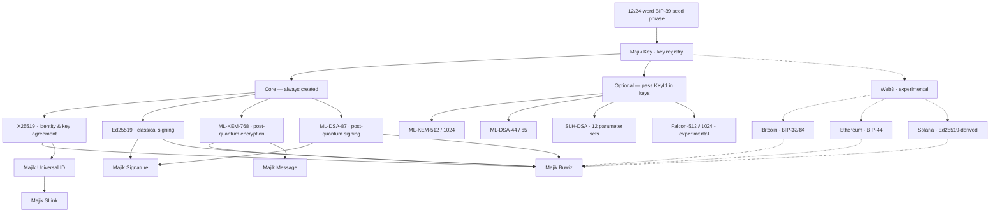

# Majik Key

[](https://doi.org/10.5281/zenodo.23208491)
[](http://majikah.solutions/articles/majik-key-whitepaper)


[](https://www.thezelijah.world) 

**Majik Key** turns a single BIP-39 mnemonic into a complete, **multi-algorithm cryptographic identity** — classical and post-quantum encryption, classical and post-quantum signing, and (experimentally) Bitcoin, Ethereum and Solana keys — encrypted at rest and ready to plug into the rest of the Majikah ecosystem.

[](https://doi.org/10.5281/zenodo.23208491)    [](https://opensource.org/licenses/Apache-2.0)

---

## Table of Contents

- [Majik Key](#majik-key)
  - [Table of Contents](#table-of-contents)
  - [Why Majik Key](#why-majik-key)
  - [What you get by default](#what-you-get-by-default)
  - [Quick Start](#quick-start)
  - [Multi-key support](#multi-key-support)
    - [Supported keys](#supported-keys)
      - [SLH-DSA performance](#slh-dsa-performance)
    - [Choosing keys at creation](#choosing-keys-at-creation)
    - [Reading keys](#reading-keys)
    - [Adding keys later](#adding-keys-later)
  - [Backward compatibility \& recovery](#backward-compatibility--recovery)
  - [🚨 If anything ever goes wrong, re-import your seed phrase 🚨](#-if-anything-ever-goes-wrong-re-import-your-seed-phrase-)
  - [Security Architecture](#security-architecture)
    - [How keys are derived](#how-keys-are-derived)
  - [Performance \& Benchmarks](#performance--benchmarks)
    - [Measured Test Duration (Node.js, pure-JS Argon2id)](#measured-test-duration-nodejs-pure-js-argon2id)
    - [KDF Evaluations per Operation](#kdf-evaluations-per-operation)
  - [Architecture](#architecture)
  - [Powering the Majikah Ecosystem](#powering-the-majikah-ecosystem)
    - [Majik Signature — Flagship](#majik-signature--flagship)
    - [Majik Message](#majik-message)
    - [Majik Buwiz](#majik-buwiz)
    - [Majik Universal ID \& Majik SLink](#majik-universal-id--majik-slink)
  - [Experimental Web3 Support](#experimental-web3-support)
    - [What needs an extra install](#what-needs-an-extra-install)
    - [Ethereum](#ethereum)
    - [Two Bitcoin paths, on purpose](#two-bitcoin-paths-on-purpose)
    - [Two Solana paths, on purpose](#two-solana-paths-on-purpose)
  - [Installation](#installation)
  - [API Reference](#api-reference)
    - [Static methods](#static-methods)
    - [Instance methods — state \& management](#instance-methods--state--management)
    - [Instance methods — key registry](#instance-methods--key-registry)
    - [Export \& integration methods](#export--integration-methods)
    - [Instance getters](#instance-getters)
    - [Web3 (experimental)](#web3-experimental)
    - [⚠️ Deprecated (still supported until the next major)](#️-deprecated-still-supported-until-the-next-major)
    - [Serialized shape](#serialized-shape)
  - [Usage Examples](#usage-examples)
    - [1. Secure backup \& recovery workflow](#1-secure-backup--recovery-workflow)
    - [2. Multi-algorithm account](#2-multi-algorithm-account)
    - [3. Scoped secret access with `withAutoLock`](#3-scoped-secret-access-with-withautolock)
    - [4. Password verification before action](#4-password-verification-before-action)
    - [5. Completing or extending an existing account](#5-completing-or-extending-an-existing-account)
    - [6. Server-side secret injection (Dangerous JSON)](#6-server-side-secret-injection-dangerous-json)
    - [7. Experimental Web3 usage](#7-experimental-web3-usage)
  - [Upgrading from earlier versions](#upgrading-from-earlier-versions)
  - [Security Best Practices](#security-best-practices)
  - [Ecosystem](#ecosystem)
  - [License](#license)
  - [Author](#author)
  - [Contact](#contact)


---

## Why Majik Key

- **One seed, one identity, as many keys as you need.** A 12- or 24-word mnemonic deterministically derives every keypair on the account. Lose the device, keep the phrase, and everything comes back.
- **A key registry, not a fixed key set.** Every key has a namespaced id (`pq:ml-dsa-87`, `classic:ed25519`, `web3:eth`, …). New algorithms are added to the registry without ever changing the keys you already have.
- **Post-quantum from day one.** Every account gets ML-KEM-768 (FIPS 203) for encryption and ML-DSA-87 (FIPS 204) for signing alongside X25519 and Ed25519 — no separate migration project later.
- **Encrypted at rest, always.** Private key material is never persisted in plaintext. Everything is AES-256-GCM encrypted with a key derived by Argon2id.
- **Backward compatible.** Accounts created by earlier versions load and work unchanged. If anything ever goes wrong, re-importing the same seed phrase restores the same keys.
- **Local-first.** Key generation and derivation run entirely offline — no network request is made in the process, verifiable directly in source.
- **Built for the Majikah ecosystem**, but usable standalone in any TypeScript/JavaScript project.

---

## What you get by default

Every new account automatically contains **these four keypairs** — you don't ask for them and you can't create an account without them:

| Key id            | Algorithm             | Purpose                                        |
| :---------------- | :-------------------- | :--------------------------------------------- |
| `classic:x25519`  | X25519                | Identity, fingerprint, classical key agreement |
| `classic:ed25519` | Ed25519               | Classical signing                              |
| `pq:ml-kem-768`   | ML-KEM-768 (FIPS 203) | Post-quantum encryption (key encapsulation)    |
| `pq:ml-dsa-87`    | ML-DSA-87 (FIPS 204)  | Post-quantum signing                           |

These four are the **core set** (`CORE_KEYS`). A Solana keypair (`web3:sol`) is also always available as a *derived view* of your Ed25519 key — it costs no extra storage.

**Want more? Use `KeyId` and pass it to `create()` via `keys`:**

```typescript
import { MajikKey, KeyId } from '@majikah/majik-key';

const key = await MajikKey.create(mnemonic, passphrase, 'My Account', {
  keys: [KeyId.ETH, KeyId.BTC, KeyId.ML_KEM_1024],   // extras ON TOP of the core four
});
```

`keys` is **additive**: the core four are always included, duplicates collapse, and an unusable id (reserved, unsupported, unknown) is rejected up front, before any derivation work happens.

---

## Quick Start

```typescript
import { MajikKey, KeyId } from '@majikah/majik-key';

// 1. Generate & create — the core four keypairs are derived automatically
const mnemonic = await MajikKey.generateMnemonic();            // 12 words (128-bit)
const key = await MajikKey.create(mnemonic, 'super-secure-passphrase', 'My PQ Account');

// 2. Identity
console.log('Fingerprint:', key.fingerprint);
console.log('Unlocked?', key.isUnlocked);                       // true — create() returns an unlocked key
console.log(key.availableKeys());
// ['classic:x25519', 'classic:ed25519', 'pq:ml-kem-768', 'pq:ml-dsa-87', 'web3:sol']

// 3. Use any key by id
const publicKey  = key.getPublicKey(KeyId.ML_DSA_87);           // Uint8Array — works even when locked
const privateKey = key.getPrivateKey(KeyId.ML_DSA_87);          // Uint8Array — throws if locked

// 4. Lock to purge every secret from memory (zeroized in place)
key.lock();

// 5. Unlock again when you need cryptographic operations
await key.unlock('super-secure-passphrase');

// 6. Safe storage — toJSON()/toString() never contain raw private keys
localStorage.setItem('myKey', key.toString());
const restored = MajikKey.fromJSON(localStorage.getItem('myKey')!);   // starts locked
```

---

## Multi-key support

### Supported keys

Every key is addressed by a namespaced id, exposed as the `KeyId` constant (`<family>:<name>`).

| Family         | `KeyId`                                           | Algorithm                      | Status                                                           |
| :------------- | :------------------------------------------------ | :----------------------------- | :--------------------------------------------------------------- |
| classic        | `KeyId.X25519`, `KeyId.ED25519`                   | X25519, Ed25519                | ✅ core — always created                                          |
| pq (KEM)       | `KeyId.ML_KEM_768`                                | ML-KEM-768                     | ✅ core — always created                                          |
| pq (KEM)       | `KeyId.ML_KEM_512`, `KeyId.ML_KEM_1024`           | ML-KEM-512 / 1024              | ✅ stable, opt-in                                                 |
| pq (signature) | `KeyId.ML_DSA_87`                                 | ML-DSA-87                      | ✅ core — always created                                          |
| pq (signature) | `KeyId.ML_DSA_44`, `KeyId.ML_DSA_65`              | ML-DSA-44 / 65                 | ✅ stable, opt-in                                                 |
| pq (signature) | `KeyId.SLH_DSA_SHAKE_128F`, … (12 parameter sets) | SLH-DSA (FIPS 205, hash-based) | ✅ stable, opt-in — see [performance note](#slh-dsa-performance)  |
| pq (signature) | `KeyId.FALCON_512`, `KeyId.FALCON_1024`           | Falcon (NIST Round 3)          | 🧪 experimental — **not** FIPS 206                                |
| web3           | `KeyId.BTC`                                       | Bitcoin (secp256k1, BIP-32/84) | 🧪 experimental, opt-in                                           |
| web3           | `KeyId.ETH`                                       | Ethereum (secp256k1, BIP-44)   | 🧪 experimental, opt-in                                           |
| web3           | `KeyId.SOL`                                       | Solana (Ed25519-derived)       | 🧪 experimental, derived view — always available                  |
| pq (KEM)       | `KeyId.HQC_128`, `_192`, `_256`                   | HQC                            | ⏳ reserved — standard not final, no vetted JS implementation yet |
| pq (signature) | `KeyId.FN_DSA_512`, `KeyId.FN_DSA_1024`           | FN-DSA (FIPS 206)              | ⏳ reserved until FIPS 206 is final                               |
| pq (signature) | `KeyId.LMS`                                       | LMS / HSS (SP 800-208)         | 🚫 not supported — see below                                      |

`MajikKey.supportedKeys()` returns every id this library version can actually create.

**Why LMS is not offered.** LMS is a *stateful* signature scheme: every signature consumes a one-time key index that must never be reused. Mnemonic recovery, backups, restores and multi-device use all reset that state, which makes index reuse — and with it, total forgery — likely. That directly conflicts with "recover everything from the mnemonic," so Majik Key refuses it rather than offer a footgun.

**Why Falcon is named `falcon`, not `fn-dsa`.** What libraries ship today is Falcon as submitted to NIST Round 3. The final FN-DSA (FIPS 206) is expected to be incompatible, so it will get its own ids later instead of silently changing what `pq:falcon-*` means.

#### SLH-DSA performance

SLH-DSA key generation in JavaScript takes **~60–330 ms for the `f` ("fast") variants** but **~4–8 seconds for the `s` ("small") variants**. The `s` variants have smaller signatures (~8 KB vs ~17 KB) but will block a browser tab during `create()`/`addKeys()` — run them in a Web Worker. We recommend `KeyId.SLH_DSA_SHAKE_128F` as the default choice and `KeyId.SLH_DSA_SHAKE_256F` for high assurance.

### Choosing keys at creation

```typescript
const key = await MajikKey.create(mnemonic, passphrase, 'Label', {
  mnemonicLanguage: 'en',
  keys: [KeyId.ML_KEM_1024, KeyId.ML_DSA_65, KeyId.SLH_DSA_SHAKE_128F, KeyId.ETH],
});
```

The same `keys` option works on `fromMnemonicJSON()` and `importFromMnemonicBackup()`.

### Reading keys

```typescript
// Presence checks — work while the account is locked
key.hasKey(KeyId.ETH);                          // boolean
key.hasKeys([KeyId.ED25519, KeyId.ML_DSA_87]);  // boolean (all present?)
key.missingKeys([KeyId.ETH, KeyId.ML_KEM_1024]);// KeyId[] that are NOT on this account
key.isCoreComplete;                             // true when all four core keys exist

// Inventory
key.availableKeys();                            // KeyId[] in canonical order
key.availableKeys({ family: 'pq' });            // filter by namespace: 'classic' | 'pq' | 'web3'
key.listKeys();                                 // [{ id, family, purpose, kind, status, publicKeyBase64 }] — no secrets

// Bytes
key.getPublicKey(KeyId.ML_KEM_1024);            // Uint8Array — works while locked
key.getPrivateKey(KeyId.ML_KEM_1024);           // Uint8Array — throws if locked

// Or a handle with .public / .private
const kp = key.getKeypair(KeyId.ML_DSA_65);
kp.public;          // Uint8Array
kp.publicBase64;    // string
kp.private;         // Uint8Array — throws if the account is locked
kp.algorithm;       // 'pq:ml-dsa-65'    kp.family; kp.purpose; kp.status; kp.isUnlocked
```

A `getKeypair()` handle **reads live from the account** instead of copying key bytes, so a handle you grabbed before `lock()` can never expose stale or zeroized material — after `lock()`, `.private` throws and `.public` still works.

### Adding keys later

New algorithms are derived from the seed, and **the seed is never stored** — so adding a key to an existing account requires the mnemonic (and the current passphrase):

```typescript
const added = await key.addKeys([KeyId.ETH, KeyId.ML_KEM_1024], mnemonic, passphrase);
console.log(added);   // ['pq:ml-kem-1024', 'web3:eth'] — only what was actually missing
```

`addKeys()` is safe by construction: the passphrase must decrypt your X25519 key **and** the mnemonic must reproduce your account's fingerprint before anything is added. It's idempotent, skips keys you already have, and works on a locked account (the new secret stays encrypted). The account must be on Argon2id — call `migrate(passphrase)` first on very old accounts.

---

## Backward compatibility & recovery

**Everything created by earlier versions keeps working — nothing to migrate by hand.**

| You have…                                                          | What happens                                                                                                                             |
| :----------------------------------------------------------------- | :--------------------------------------------------------------------------------------------------------------------------------------- |
| JSON from an older version (no `keys` field)                       | `fromJSON()` upgrades it **automatically, in memory** — no passphrase or mnemonic needed. Call `toJSON()` to persist the upgraded shape. |
| An account on the legacy PBKDF2 KDF (v1)                           | Still unlocks. `updatePassphrase()` or `migrate()` moves it to Argon2id.                                                                 |
| An account missing newer core keys (e.g. no ML-KEM/Ed25519/ML-DSA) | Loads fine; `key.missingKeys()` lists what's absent and `addKeys(CORE_KEYS, mnemonic, passphrase)` completes it.                         |
| A mnemonic backup created before this version                      | `importFromMnemonicBackup()` still reads it (legacy salts are retained read-only).                                                       |
| An older-version call like `key.getEdSecretKey()`                  | Still works — marked `@deprecated`, a thin wrapper over the registry.                                                                    |
| Entries written by a *newer* library version                       | Preserved untouched on a round-trip, never dropped (they're just not usable until you upgrade).                                          |

## <h1 style="color:#d1242f;">🚨 If anything ever goes wrong, re-import your seed phrase 🚨</h1>


>
> Every key is **deterministically derived** from the mnemonic. Re-importing the same seed phrase always reproduces the same keys, the same fingerprint and the same addresses — under any passphrase you choose.

 ```typescript
 // Same mnemonic → identical keys. 
 // Pass the same extra `keys` you used before.
const restored = await MajikKey.create(
  mnemonic,
  newPassphrase,
  'Restored', {
    keys: [KeyId.ETH, KeyId.ML_KEM_1024],
  });

 // Or verify against an existing backup blob first, then re-derive:
const restored2 = await MajikKey.importFromMnemonicBackup(
  backup,
  mnemonic, 
  newPassphrase, 
  'Restored',
  {
    keys: [KeyId.ETH, KeyId.ML_KEM_1024],
  });

```

> Re-importing derives the **core four plus whatever you pass in `keys`**. If your account had extra keys, pass them again — or call `addKeys()` afterwards. Accounts created before this version had **Bitcoin by default**; to get it back on a re-import, pass `keys: [KeyId.BTC]` (or the legacy `deriveBitcoin: true`).

The legacy derivation recipes for X25519, Ed25519, ML-KEM-768, ML-DSA-87 and Bitcoin are **frozen and pinned by known-answer test vectors**: no release can change the keys a given mnemonic produces.

---

## Security Architecture

- **Encrypted at rest, not "hashed."** Private keys are **AES-256-GCM encrypted** with a 256-bit key **derived via Argon2id** from your passphrase. (Argon2id is a key-derivation function; the private key itself is encrypted, not hashed.)
- **One KDF run per operation.** `create()`, `unlock()` and `updatePassphrase()` derive the vault key **once** and use it for every key on the account, so unlock time does not grow as you add algorithms. Each key is sealed with its own random IV.
- **Argon2id KDF (v2), memory-hard by design.** Passphrase encryption uses Argon2id at **64 MB memory / 3 iterations / 4 parallel lanes**. A WASM implementation (`hash-wasm`) is used when available, with an automatic, transparent fallback to pure JS (`@noble/hashes`) — output is bit-identical either way.
- **Atomic by design.** `unlock()` is all-or-nothing: if any key fails to decrypt, the account stays fully locked. `updatePassphrase()` and `migrate()` decrypt everything first and only then commit — a failure can never leave a new salt paired with ciphertext from the old one.
- **Zeroization.** `lock()` zeroizes secret buffers in place, and intermediate key material is wiped after use.
- **Post-quantum ready.** ML-KEM-768 is derived from the full 64-byte BIP-39 seed; ML-DSA-87 from a domain-separated hash of it. Every algorithm added since uses a documented, versioned HKDF recipe (below).
- **Legacy KDF read support.** Accounts encrypted with KDF v1 (PBKDF2-SHA256) can still be unlocked. New accounts, and any account whose passphrase changes, always land on Argon2id.
- **Multi-language mnemonics.** BIP-39 wordlists for English, French, Spanish, Italian, Japanese, Korean, Czech, Portuguese, Simplified Chinese and Traditional Chinese, lazy-loaded per language. The language is remembered on the account and survives JSON, backup and import round-trips.
- **Isomorphic by design.** Uses native WebCrypto where the runtime supports it and a raw-key fallback where it doesn't; the public API is identical either way.

### How keys are derived

| Keys                                                             | Recipe                                                                                                   | Stability                      |
| :--------------------------------------------------------------- | :------------------------------------------------------------------------------------------------------- | :----------------------------- |
| X25519                                                           | converted (ed2curve) from the Ed25519 key                                                                | 🔒 frozen (`legacy-v1`)         |
| Ed25519                                                          | BIP-39 seed `[0..32]`                                                                                    | 🔒 frozen                       |
| ML-KEM-768                                                       | the full 64-byte BIP-39 seed                                                                             | 🔒 frozen                       |
| ML-DSA-87                                                        | `sha256(seed ‖ "MajikSignatureSeedDSA")`                                                                 | 🔒 frozen                       |
| Bitcoin                                                          | BIP-32 `m/84'/1971'/0'/0/0` (Majik domain path)                                                          | 🔒 frozen                       |
| Ethereum                                                         | BIP-32 `m/44'/60'/0'/0/0` (standard path)                                                                | stable                         |
| Solana                                                           | `sha256(edSeed ‖ "MajikKeySolanaSeed")` — derived on demand                                              | stable                         |
| Everything else (ML-KEM-512/1024, ML-DSA-44/65, SLH-DSA, Falcon) | `HKDF-SHA512(seed, salt = "MajikKey/hkdf-sha512/v1", info = "majik/v1/<key id>")` → the algorithm's seed | stable, pinned by test vectors |

Because each algorithm gets its own HKDF `info` string, no two keys ever receive related seed material, and adding a new algorithm can never change an existing key. Each stored key also records its own `derivation` recipe in the JSON.

---

## Performance & Benchmarks

Starting in `v1.0.0`, key derivation uses a single vault-key KDF evaluation per operation. Instead of re-running Argon2id for every individual key in the account, the vault key is derived **once**, reducing Argon2id evaluations by up to **80%** and wall-clock execution time by **~68%**.

### Measured Test Duration (Node.js, pure-JS Argon2id)


```mermaid
xychart-beta
    title "Measured test duration in seconds (0.7.x vs 1.0.0)"
    x-axis ["create()", "create + unlock", "create + import", "full vector suite"]
    y-axis "Seconds (wall clock)" 0 --> 30
    bar [5.6, 9.7, 10.5, 25.9]
    bar [2.0, 2.7, 3.6, 8.3]
```

| Operation | 0.7.x | 1.0.0 | Improvement |
| :--- | :--- | :--- | :--- |
| `create()` | 5.6s | **2.0s** | ⚡ **64% faster** |
| `create + unlock` | 9.7s | **2.7s** | ⚡ **72% faster** |
| `create + import backup` | 10.5s | **3.6s** | ⚡ **66% faster** |
| `full vector suite` | 25.9s | **8.3s** | ⚡ **68% faster** |

---

### KDF Evaluations per Operation


```mermaid
xychart-beta
    title "Argon2id evaluations per operation (0.7.x vs 1.0.0)"
    x-axis ["create", "unlock", "update passphrase", "import backup"]
    y-axis "Evaluations" 0 --> 10
    bar [6, 5, 10, 6]
    bar [2, 1, 2, 2]
```

| Operation | 0.7.x | 1.0.0 | Reduction |
| :--- | :--- | :--- | :--- |
| `create` | 6 evaluations | **2 evaluations** | **67% reduction** |
| `unlock` | 5 evaluations | **1 evaluation** | **80% reduction** |
| `update passphrase` | 10 evaluations | **2 evaluations** | **80% reduction** |
| `import backup` | 6 evaluations | **2 evaluations** | **67% reduction** |

*Figure 3. Measured test duration and Argon2id evaluations per operation, 0.7.x versus 1.0.0.*

---

## Architecture


```mermaid
flowchart TD
    A["12/24-word BIP-39 seed phrase"] --> B["Majik Key · key registry"]

    B --> C["Core — always created"]
    C --> C1["X25519 · identity & key agreement"]
    C --> C2["Ed25519 · classical signing"]
    C --> C3["ML-KEM-768 · post-quantum encryption"]
    C --> C4["ML-DSA-87 · post-quantum signing"]

    B --> O["Optional — pass KeyId in keys"]
    O --> O1["ML-KEM-512 / 1024"]
    O --> O2["ML-DSA-44 / 65"]
    O --> O3["SLH-DSA · 12 parameter sets"]
    O --> O4["Falcon-512 / 1024 · experimental"]

    B -.-> W["Web3 · experimental"]
    W -.-> W1["Bitcoin · BIP-32/84"]
    W -.-> W2["Ethereum · BIP-44"]
    W -.-> W3["Solana · Ed25519-derived"]

    C2 --> P1["Majik Signature"]
    C4 --> P1

    C2 --> P2["Majik Buwiz"]
    C3 --> P2
    C4 --> P2
    C1 --> P2
    W1 -.-> P2
    W2 -.-> P2
    W3 -.-> P2

    C3 --> P3["Majik Message"]

    C1 --> P4["Majik Universal ID"]
    P4 --> P5["Majik SLink"]
```

Your Majik Key is generated entirely offline. No network request is made during key creation — verifiable in source code.

---

## Powering the Majikah Ecosystem

Majik Key is the shared identity layer underneath every Majikah product. The **core four keys** are everything these products need — extra keypairs are opt-in.

### [Majik Signature](https://majikah.solutions/products/majik-signature) — Flagship

**Post-quantum cryptographic file signing and verification.**

[](https://www.npmjs.com/package/@majikah/majik-signature) [](https://www.npmjs.com/package/@majikah/majik-signature) [](https://bundlephobia.com/package/@majikah/majik-signature) [](https://opensource.org/licenses/Apache-2.0)

[](https://signature.majikah.solutions)

Majik Signature consumes a Majik Key's **Ed25519** and **ML-DSA-87** keypairs to require *both* a classical and a post-quantum signature before a file verifies — hybrid security that holds even if one scheme is later broken.

```typescript
import { MajikKey } from '@majikah/majik-key';
import { MajikSignature } from '@majikah/majik-signature';

// 1. Sign a file and embed the signature (requires an unlocked key with signing keys)
const { blob, signature } = await MajikSignature.signFile(myFileBlob, myUnlockedKey, {
  // Optional: restrict future signers
  expectedSigners: [ MajikSignature.expectedSignerFromKey(myUnlockedKey) ]
});

// 2. Verify a signed file's embedded signatures
const results = await MajikSignature.verifyFile(blob, myUnlockedKey);
results.forEach(res => {
  console.log(`Signer ${res.signerId} valid?`, res.valid);
});

// 3. Seal a multi-sig file to prevent further signatures
const { sealInfo } = await MajikSignature.seal(blob, myUnlockedKey);
console.log("File sealed at:", sealInfo.sealTimestamp);
```

### Majik Message

**Post-quantum secure messaging envelopes.**

Majik Key's ML-KEM-768 keypair is used for Majik Message's v3 secure envelopes: ML-KEM-768 handles post-quantum key encapsulation, and AES-256-GCM handles the payload once a shared secret is established.

`toMajikMessageIdentity()` converts an unlocked key into a `MajikMessageIdentity`, ready to hand to Majik Message.

```typescript
import { MajikKey } from '@majikah/majik-key';

// user: an existing MajikUser instance (from @thezelijah/majik-user)
const identity = await key.toMajikMessageIdentity(user, {
  label: 'My Device',
  restricted: false,
});
```

### Majik Buwiz

**Multi-key custody built on the full Majik Key stack.**

Majik Buwiz is built on Majik Key's complete key set: Ed25519 / ML-DSA-87 for signing, ML-KEM-768 / AES-256-GCM for encryption, and X25519 / BIP-39 for identity — plus the optional Bitcoin, Ethereum and Solana keys for multi-chain support. Everything a Buwiz account needs is derivable from, and recoverable with, the same mnemonic.

### Majik Universal ID & Majik SLink

**A portable identity primitive, and shareable links built on top of it.**

Majik Universal ID is built on the identity branch of Majik Key — the BIP-39-derived X25519 keypair, public key and fingerprint, exportable via `toContact()` as a `MajikContact` for use across apps. Majik SLink extends that identity layer downstream. Both are separate Majikah packages; consult [majikah.solutions](https://majikah.solutions) for the latest on their APIs.

---

## Experimental Web3 Support

Majik Key can derive **Bitcoin**, **Ethereum** and **Solana** key material from the same mnemonic. This is marked experimental — the shape of the `web3` namespace may change without a major version bump.

| Chain    | How it's provided                                                  | Opt in with         |
| :------- | :----------------------------------------------------------------- | :------------------ |
| Bitcoin  | Stored, encrypted key (BIP-32/84, Majik domain path by default)    | `keys: [KeyId.BTC]` |
| Ethereum | Stored, encrypted key (BIP-44 **standard** path)                   | `keys: [KeyId.ETH]` |
| Solana   | **Derived on demand** from your Ed25519 key — nothing extra stored | always available    |

> **Change from earlier versions:** Bitcoin is no longer derived by default. Pass `keys: [KeyId.BTC]` (or the deprecated `deriveBitcoin: true`) to create it. Existing accounts that already have a Bitcoin key keep it.

### What needs an extra install

Raw key bytes, WIF export, message signing, and Ethereum/Solana addresses work with **zero extra dependencies**. Optional peer dependencies are only needed for chain-native address/transaction objects:

| Chain    | Peer dependency     | Needed for                                                                                                                                                                  |
| :------- | :------------------ | :-------------------------------------------------------------------------------------------------------------------------------------------------------------------------- |
| Bitcoin  | `@scure/btc-signer` | Native SegWit (bech32) address encoding, PSBT construction                                                                                                                  |
| Solana   | `@solana/kit`       | Real `KeyPairSigner` instances, kit-native `Address` type                                                                                                                   |
| Ethereum | *(none)*            | Address (EIP-55), `signHash`, EIP-191 `signMessage` are built in. EIP-712 typed data and transaction building are not included yet — use viem/ethers with the exported key. |

### Ethereum

Ethereum uses the **standard path** `m/44'/60'/0'/0/0`, so the address is **the same one MetaMask, Ledger or Trezor show for the same mnemonic**.

```typescript
const key = await MajikKey.create(mnemonic, passphrase, 'Wallet', { keys: [KeyId.ETH] });

key.getEthereumAddress();                       // '0xf39F…' (EIP-55) — public-only, works while locked
key.getEthereumPrivateKeyHex();                 // '0x…' — paste into any wallet's "import private key"

const eth = key.web3?.ethereum;                 // present when unlocked
eth?.signMessage('hello');                      // EIP-191 personal_sign → { r, s, v, recovery, serialized }
eth?.signHash(hash32);                          // sign a 32-byte hash (tx hash, EIP-712 digest)
```

> ⚠️ Because the path is standard, **anyone holding the mnemonic controls the funds** at that address. There is no Majik-specific separation — that's what makes it wallet-compatible.

### Two Bitcoin paths, on purpose

By default Bitcoin keys use `MAJIK_BITCOIN_DOMAIN_PATH` (`m/84'/1971'/0'/0/0`) — real BIP-32 derivation, but not the path a generic wallet would derive, so it stays effectively private to Majik. For the actual BIP-84 mainnet key (the address any standard wallet shows for the mnemonic):

```typescript
// Majik's default (domain-separated, stored on the key)
const wif = key.getBitcoinWIF();

// The real BIP-84 mainnet key — recoverable in any standard wallet
const standardBtc = await MajikKey.deriveStandardBitcoinFromMnemonic(mnemonic);
```

### Two Solana paths, on purpose

By default (`deriveSolanaKeypairFromEdSecretKey`) the Solana keypair is domain-separated from your Ed25519 message-signing key via `SHA256(edSeed ‖ "MajikKeySolanaSeed")`, so the same private key never secures two protocols. You can opt into reusing the Ed25519 key directly:

```typescript
// Recommended: domain-separated Solana key
const solanaAddress = key.getSolanaAddress();

// Opt-in: reuse the Ed25519 message-signing key as-is (not recommended)
const reusedAddress = key.getSolanaAddress({ reuseMessageKey: true });
```

---

## Installation

```bash
npm install @majikah/majik-key
```

Optional peer dependencies (only for the features listed in the Web3 table above):

```bash
npm install @scure/btc-signer   # Bitcoin addresses / PSBTs
npm install @solana/kit         # Solana signer/address objects
```

---

## API Reference

### Static methods

| Method                                                 | Parameters                                               | Returns                           | Description                                                                                                                         |
| :----------------------------------------------------- | :------------------------------------------------------- | :-------------------------------- | :---------------------------------------------------------------------------------------------------------------------------------- |
| `create()`                                             | `mnemonic`, `passphrase`, `label?`, `options?`           | `Promise<MajikKey>`               | Creates an Argon2id-protected account with the **core four** keys plus any `options.keys`. Returns it unlocked.                     |
| `fromJSON()`                                           | `json`                                                   | `MajikKey`                        | Loads a **locked** key from safe JSON (registry or legacy shape — auto-migrates).                                                   |
| `fromMnemonicJSON()`                                   | `mnemonicJson`, `passphrase`, `label?`, `options?`       | `Promise<MajikKey>`               | Rebuilds a key from a portable seed export.                                                                                         |
| `importFromMnemonicBackup()`                           | `backup`, `mnemonic`, `passphrase`, `label?`, `options?` | `Promise<MajikKey>`               | Verifies the mnemonic against the backup, then re-derives and re-encrypts the identity (core four + `options.keys`) under Argon2id. |
| `fromDangerousJSON()`                                  | `json`                                                   | `MajikKey`                        | Reconstructs an already-unlocked key from a dangerous export. Server-side only.                                                     |
| `withAutoLock()`                                       | `key`, `operation`                                       | `Promise<T>`                      | Runs `operation` against an unlocked key and **always** re-locks it afterwards, even if the operation throws.                       |
| `generateMnemonic()`                                   | `strength?` *(128 \| 256)*, `language?`                  | `Promise<string>`                 | Generates a 12- or 24-word BIP-39 phrase.                                                                                           |
| `validateMnemonic()`                                   | `mnemonic`                                               | `boolean`                         | Validates a BIP-39 mnemonic phrase.                                                                                                 |
| `supportedKeys()`                                      | —                                                        | `KeyId[]`                         | Every key id this version can create.                                                                                               |
| `deriveStandardBitcoinFromMnemonic()` *(experimental)* | `mnemonic`, `mnemonicLanguage?`                          | `Promise<BitcoinKeypairMaterial>` | Derives the real BIP-84 mainnet key without a `MajikKey` instance.                                                                  |

**`options`** (`MajikKeyCreateOptions`):

| Option             | Type               | Description                                                          |
| :----------------- | :----------------- | :------------------------------------------------------------------- |
| `mnemonicLanguage` | `MnemonicLanguage` | BIP-39 wordlist to validate against. Default `"en"`.                 |
| `keys`             | `KeyId[]`          | **Extra** keypairs on top of the core four. Default none.            |
| `deriveBitcoin`    | `boolean`          | ⚠️ *Deprecated.* `true` adds `KeyId.BTC`. Prefer `keys: [KeyId.BTC]`. |

### Instance methods — state & management

| Method               | Parameters                      | Returns            | Description                                                                                                                           |
| :------------------- | :------------------------------ | :----------------- | :------------------------------------------------------------------------------------------------------------------------------------ |
| `unlock()`           | `passphrase`                    | `Promise<this>`    | Decrypts every key into memory with a single KDF run. Atomic.                                                                         |
| `lock()`             | —                               | `this`             | Zeroizes and purges all secret material, including cached Web3 keys.                                                                  |
| `verify()`           | `passphrase`                    | `Promise<boolean>` | Tests a passphrase without unlocking or keeping keys in memory.                                                                       |
| `updatePassphrase()` | `currentPass`, `newPass`        | `Promise<this>`    | Re-encrypts **every** stored key under a new passphrase and salt (and moves to Argon2id if needed). Atomic.                           |
| `migrate()`          | `passphrase`                    | `Promise<this>`    | Upgrades the KDF from PBKDF2 to Argon2id for every stored key. No-op if already on Argon2id. Does **not** add keys — use `addKeys()`. |
| `addKeys()`          | `ids`, `mnemonic`, `passphrase` | `Promise<KeyId[]>` | Adds missing keys. Requires the mnemonic **and** the passphrase. Returns the ids actually added.                                      |
| `updateLabel()`      | `newLabel`                      | `this`             | Updates the human-readable account label.                                                                                             |

### Instance methods — key registry

| Method                        | Returns        | Description                                                                                                         |
| :---------------------------- | :------------- | :------------------------------------------------------------------------------------------------------------------ |
| `hasKey(id)` / `hasKeys(ids)` | `boolean`      | Is the key (or are all keys) present? Works while locked.                                                           |
| `missingKeys(ids?)`           | `KeyId[]`      | Which of `ids` (default: the core four) are absent.                                                                 |
| `availableKeys({ family? })`  | `KeyId[]`      | Every available key id, canonical order, optionally filtered by family.                                             |
| `listKeys()`                  | `KeyInfo[]`    | `id`, `family`, `purpose`, `kind` (`stored`/`derived`), `status`, `publicKeyBase64`. No secrets.                    |
| `getPublicKey(id)`            | `Uint8Array`   | Public key bytes. Works while locked (derived views like `web3:sol` need an unlocked account).                      |
| `getPrivateKey(id)`           | `Uint8Array`   | Secret key bytes. Throws if locked or absent.                                                                       |
| `getKeypair(id)`              | `MajikKeypair` | Live handle: `.public`, `.publicBase64`, `.private`, `.algorithm`, `.family`, `.purpose`, `.status`, `.isUnlocked`. |

### Export & integration methods

| Method                                       | Returns                                   | Description                                                                                                                                      |
| :------------------------------------------- | :---------------------------------------- | :----------------------------------------------------------------------------------------------------------------------------------------------- |
| `toJSON(options?)` / `toString()`            | `MajikKeyJSON` / `string`                 | Safe export for DB/LocalStorage. No raw keys. `toJSON({ legacy: false })` omits the pre-registry flat fields (see below).                        |
| `toDangerousJSON()`                          | `MajikKeyDangerousJSON`                   | ⚠️ Contains every raw private key. Server-side secret injection only.                                                                             |
| `toMnemonicJSON()`                           | `MnemonicJSON`                            | ⚠️ Contains the raw mnemonic words (and passphrase, if given) in plaintext — a transport format, not an at-rest format. Requires an unlocked key. |
| `exportMnemonicBackup()`                     | `Promise<string>`                         | Encrypted backup string, decryptable only with the original mnemonic.                                                                            |
| `toContact()`                                | `MajikContact`                            | Public identity data for sharing (the basis for Majik Universal ID).                                                                             |
| `toKeyIdentity()` / `toSerializedIdentity()` | `MajikKeyIdentity` / `SerializedIdentity` | Identity bundles for other Majikah packages. Require an unlocked key.                                                                            |
| `toMajikMessageIdentity()`                   | `Promise<MajikMessageIdentity>`           | Formats the key for Majik Message. Requires a `MajikUser`.                                                                                       |

### Instance getters

*Public — available at any time, regardless of lock state:*

`id`, `fingerprint`, `publicKey`, `publicKeyBase64`, `label`, `backup`, `timestamp`, `mnemonicLanguage`, `kdfVersion`, `isArgon2id`, `isLocked`, `isUnlocked`, `isCoreComplete`, `isFullyUpgraded`, `hasBitcoin`, `hasEthereum`, `metadata` (includes `keys: KeyId[]`).

*Unlocked-only capabilities:* `hasBitcoinKeypair`, `hasSolanaKeypair`, `web3`.

### Web3 (experimental)

| Member                                            | Returns                                        | Notes                                                                                                                |
| :------------------------------------------------ | :--------------------------------------------- | :------------------------------------------------------------------------------------------------------------------- |
| `web3` *(getter)*                                 | `{ solana, bitcoin?, ethereum? } \| undefined` | `undefined` if locked or there's no Ed25519 key. `bitcoin` / `ethereum` appear only if the account holds those keys. |
| `getEthereumAddress()`                            | `string`                                       | EIP-55 address. Public-only — works while locked.                                                                    |
| `getEthereumPrivateKeyHex()`                      | `string`                                       | `0x…` private key. Requires an unlocked key.                                                                         |
| `getEthereumKeypairMaterial()`                    | `EthereumKeypairMaterial`                      | Raw bytes. Requires an unlocked key.                                                                                 |
| `getBitcoinKeypairMaterial()` / `getBitcoinWIF()` | `BitcoinKeypairMaterial` / `string`            | Stored (domain-separated) key.                                                                                       |
| `getSolanaKeypairMaterial()`                      | `SolanaKeypairMaterial`                        | Raw Solana keypair bytes.                                                                                            |
| `getSolanaKeypair()`                              | `Promise<any>`                                 | Real `@solana/kit` `KeyPairSigner`. Requires `@solana/kit`.                                                          |
| `getSolanaAddress()`                              | `string`                                       | Base58 address. No extra dependency.                                                                                 |

### ⚠️ Deprecated (still supported until the next major)

These keep working as thin wrappers over the registry. Prefer the replacement.

| Deprecated                                                                                              | Use instead                          |
| :------------------------------------------------------------------------------------------------------ | :----------------------------------- |
| `mlKemPublicKey`, `edPublicKey`, `mlDsaPublicKey`, `btcPublicKey`                                       | `getPublicKey(KeyId.…)`              |
| `mlKemSecretKey`, `getMlKemSecretKey()`, `getEdSecretKey()`, `getMlDsaSecretKey()`, `getBtcSecretKey()` | `getPrivateKey(KeyId.…)`             |
| `getPrivateKey()` *(no argument)*, `getPrivateKeyBase64()`                                              | `getPrivateKey(KeyId.X25519)`        |
| `hasMlKem`, `hasSigningKeys`, `hasBitcoin`                                                              | `hasKey(KeyId.…)` / `hasKeys([...])` |
| `deriveBitcoin: true` *(option)*                                                                        | `keys: [KeyId.BTC]`                  |

### Serialized shape

`toJSON()` writes the registry under `keys`:

```jsonc
{
  "id": "…", "label": "…", "fingerprint": "…", "publicKey": "…",   // X25519 public key
  "salt": "…", "backup": "…", "timestamp": "…", "kdfVersion": 2, "mnemonicLanguage": "en",
  "keysVersion": 1,
  "keys": [
    {
      "id": "pq:ml-dsa-87",
      "publicKey": "…",                       // base64
      "encryptedSecretKey": "…",              // base64, AES-256-GCM (IV ‖ ciphertext) — never a raw key
      "derivation": { "scheme": "legacy-v1", "version": 1, "note": "…" },
      "createdAt": "…"
    }
    // …one entry per stored key
  ]
}
```

**By default `toJSON()` also writes the original flat fields** (`encryptedMlKemSecretKey`, `edPublicKey`, …) so older versions of the library — and other implementations such as the Rust port — can still read what you save. Keys that didn't exist before the registry (ML-KEM-1024, Ethereum, SLH-DSA, …) are written **only** to `keys`. Pass `toJSON({ legacy: false })` for registry-only output. The flat fields will stop being written by default in the next major version.

---

## Usage Examples

### 1. Secure backup & recovery workflow

```typescript
import { MajikKey, KeyId } from '@majikah/majik-key';

// -- EXPORTING --
// ⚠️ jsonData contains the raw mnemonic (and passphrase, if provided) in plaintext.
// Treat it exactly like the mnemonic itself — encrypt the file yourself, or keep it offline.
// It is a transport format, not a safe-storage format.
const jsonData = key.toMnemonicJSON(mnemonic, 'password123');
const blob = new Blob([JSON.stringify(jsonData)], { type: 'application/json' });
// Save blob to a secure location...

// -- RECOVERING --
const recoveredData = JSON.parse(await blob.text());
const recoveredKey = await MajikKey.importFromMnemonicBackup(
  recoveredData.id,
  recoveredData.seed.join(' '),
  recoveredData.phrase,
  'Recovered Key',
  { mnemonicLanguage: recoveredData.language, keys: [KeyId.ETH] },   // re-create the same extras
);
```

### 2. Multi-algorithm account

```typescript
import { MajikKey, KeyId } from '@majikah/majik-key';
import { ml_kem1024 } from '@noble/post-quantum/ml-kem.js';
import { ml_dsa65 } from '@noble/post-quantum/ml-dsa.js';

const key = await MajikKey.create(mnemonic, passphrase, 'PQ+', {
  keys: [KeyId.ML_KEM_1024, KeyId.ML_DSA_65],
});

// Encapsulate to yourself with ML-KEM-1024
const kem = key.getKeypair(KeyId.ML_KEM_1024);
const { cipherText, sharedSecret } = ml_kem1024.encapsulate(kem.public);
const same = ml_kem1024.decapsulate(cipherText, kem.private);   // === sharedSecret

// Sign with ML-DSA-65
const dsa = key.getKeypair(KeyId.ML_DSA_65);
const msg = new TextEncoder().encode('hello');
const sig = ml_dsa65.sign(msg, dsa.private);
ml_dsa65.verify(sig, msg, dsa.public);                          // true
```

### 3. Scoped secret access with `withAutoLock`

```typescript
await key.unlock(passphrase);

const signature = await MajikKey.withAutoLock(key, async (k) => {
  const secret = k.getPrivateKey(KeyId.ED25519);
  return mySign(secret, payload);
});

key.isLocked;   // true — locked even if mySign threw
```

### 4. Password verification before action

```typescript
const key = MajikKey.fromJSON(storedJson);

if (await key.verify('user-input-password')) {
  await key.unlock('user-input-password');
  // ... proceed with signing/encryption
  key.lock(); // Always clean up!
} else {
  throw new Error('Invalid passphrase');
}
```

### 5. Completing or extending an existing account

```typescript
const key = MajikKey.fromJSON(oldStoredJson);        // any previous version

if (!key.isCoreComplete) {
  console.log('Missing:', key.missingKeys());        // e.g. ['classic:ed25519', 'pq:ml-dsa-87']
  await key.addKeys(CORE_KEYS, mnemonic, passphrase);
}

await key.addKeys([KeyId.ETH], mnemonic, passphrase);
localStorage.setItem('myKey', key.toString());       // persists the registry shape
```

### 6. Server-side secret injection (Dangerous JSON)

`toDangerousJSON()` / `fromDangerousJSON()` skip encryption entirely — no KDF, no AES-GCM, instant reconstruction. This exists for one narrow case: injecting a pre-unlocked signing key into a server process, not for anything that touches a database, log or the network. The export includes the raw secret of **every** stored key (a `secretKeys` map, plus the legacy fields).

```typescript
// At deploy time, generated once and stored in your secrets manager:
const dangerousJson = unlockedKey.toDangerousJSON();

// At server boot:
const serverKey = MajikKey.fromDangerousJSON(process.env.MAJIK_SIGNING_KEY!);
// serverKey is already unlocked — no passphrase needed, no KDF cost.
```

### 7. Experimental Web3 usage

```typescript
const key = await MajikKey.create(mnemonic, passphrase, 'Multi-chain', {
  keys: [KeyId.BTC, KeyId.ETH],
});

// Bitcoin
console.log('Bitcoin WIF:', key.getBitcoinWIF());
console.log('Bitcoin address:', await key.web3?.bitcoin?.getBitcoinAddress());   // needs @scure/btc-signer

// Ethereum (no extra dependency)
console.log('ETH address:', key.getEthereumAddress());
const sig = key.web3?.ethereum?.signMessage('hello');

// Solana — derived on demand from your Ed25519 key
console.log('Solana address:', key.getSolanaAddress());                            // no extra dependency
const solanaSigner = await key.getSolanaKeypair();                                 // needs @solana/kit
```

---

## Upgrading from earlier versions

**No migration step is required.** Install the new version and your existing stored keys, backups and code keep working. The things that behave differently:

| Change                                                                          | Impact                                                                                                                                                                 | What to do                                                                               |
| :------------------------------------------------------------------------------ | :--------------------------------------------------------------------------------------------------------------------------------------------------------------------- | :--------------------------------------------------------------------------------------- |
| **Bitcoin is no longer created by default**                                     | New accounts have the core four only. Existing accounts keep any Bitcoin key they have.                                                                                | Pass `keys: [KeyId.BTC]` (or `deriveBitcoin: true`) where you rely on `web3.bitcoin`.    |
| **`toJSON()` now includes `keys`** (plus the old flat fields by default)        | Larger JSON (roughly double while both are written). Older readers still work.                                                                                         | Nothing — or `toJSON({ legacy: false })` once all your readers are updated.              |
| **Mnemonic backups use renamed salts** (`MajikKey…` instead of `MajikMessage…`) | Backups written by this version record a `backupSaltVersion`; older backups are still readable. **Older library versions can't read backups written by this version.** | Update every consumer (and the Rust port) before relying on cross-version backup import. |
| **Wrong-passphrase error text**                                                 | Message now reads *"Failed to decrypt classic:x25519 secret key — incorrect passphrase or corrupted data"*.                                                            | Match on `incorrect passphrase or corrupted data` rather than the old prefix.            |
| **`getPrivateKey()` gained an overload**                                        | The no-argument form still returns the X25519 key wrapper; `getPrivateKey(id)` returns bytes.                                                                          | Prefer `getPrivateKey(KeyId.X25519)`.                                                    |
| **Per-algorithm getters are deprecated**                                        | Still supported until the next major.                                                                                                                                  | Migrate to `getPublicKey(id)` / `getPrivateKey(id)` at your pace.                        |
| **`importFromMnemonicBackup()` keeps the mnemonic language**                    | Previously a non-English account silently reset to `"en"`.                                                                                                             | Pass `{ mnemonicLanguage }` as the 5th-argument option.                                  |

If anything looks off after upgrading, **re-import your seed phrase** (see [Backward compatibility & recovery](#backward-compatibility--recovery)) — the keys it produces never change.

---

## Security Best Practices

✅ **DO:**
- Back up your **mnemonic** offline. It is the master secret and the only thing needed to recover every key.
- Call `.lock()` immediately after signing or decrypting, or use `MajikKey.withAutoLock()` so it happens even on errors.
- Use `mlKemPublicKey` / `getPublicKey(KeyId.ML_KEM_768)` for all new communication protocols to stay post-quantum ready.
- Enable only the extra algorithms you need — every key you add is one more secret to protect.
- Run SLH-DSA `s` variants in a Web Worker.
- Keep `@scure/bip39` and the underlying crypto dependencies up to date.

❌ **DON'T:**
- Log `mnemonic` phrases, `privateKeyBase64`, or any `*SecretKeyBase64` / `secretKeys` value in production.
- Use `toDangerousJSON()` / `fromDangerousJSON()` outside controlled, server-side secret injection.
- Store the output of `toMnemonicJSON()` unencrypted — it is not the same as `toJSON()` / `toString()`.
- Reuse a funded Ethereum or Bitcoin mnemonic for anything you don't fully trust: standard-path wallets are controlled by the mnemonic alone.

---

## Ecosystem

- [Majik Signature Web App](https://signature.majikah.solutions)
- [Majik Signature on Microsoft Store](https://apps.microsoft.com/detail/9pl9g3xzvd1x)
- [Majik Signature Official Repository](https://github.com/Majikah/majik-signature)
- [Majikah Solutions](https://majikah.solutions)

---

## License

**License:** [Apache-2.0](LICENSE) — free for personal and commercial use.

## Author

Developed by **Josef Elijah Fabian (Zelijah)** | [Majikah Solutions OPC](https://majikah.solutions/about)

**Developer**: [Josef Elijah Fabian](https://github.com/jedlsf)

**GitHub**: [https://github.com/Majikah](https://github.com/Majikah)

**Project Repository**: [https://github.com/Majikah/majik-signature](https://github.com/Majikah/majik-signature)

**Technical Whitepaper**: [https://zenodo.org/records/23208491](https://zenodo.org/records/23208491)

---

## Contact

- **Business Email**: [business@majikah.solutions](mailto:business@majikah.solutions)
- **Official Website**: [https://www.thezelijah.world](https://www.thezelijah.world)
- **Majikah Ecosystem**: [https://majikah.solutions](https://majikah.solutions)